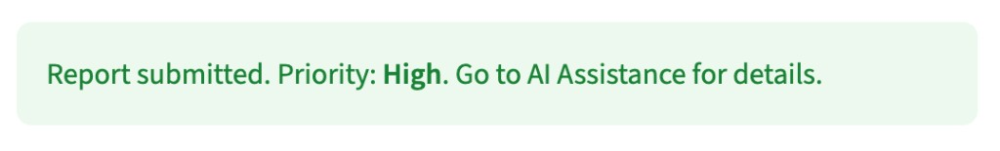
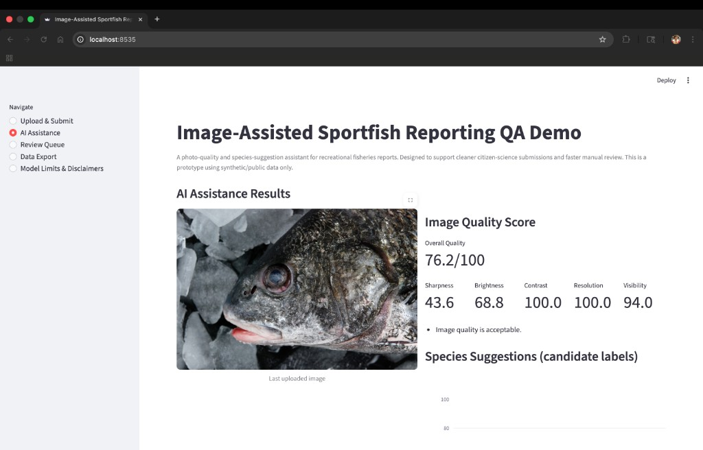
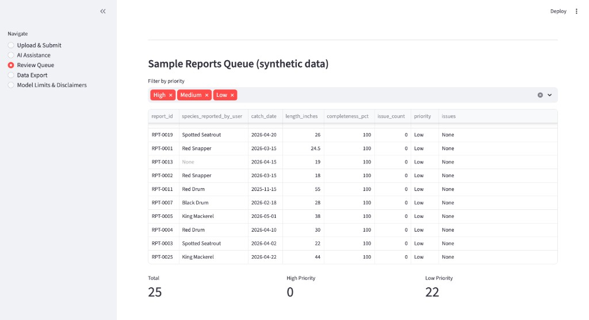
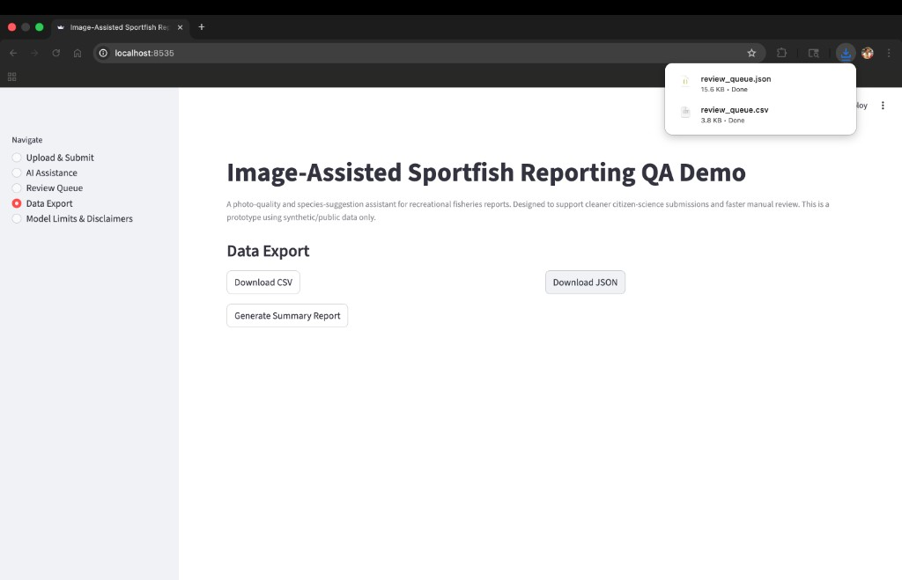
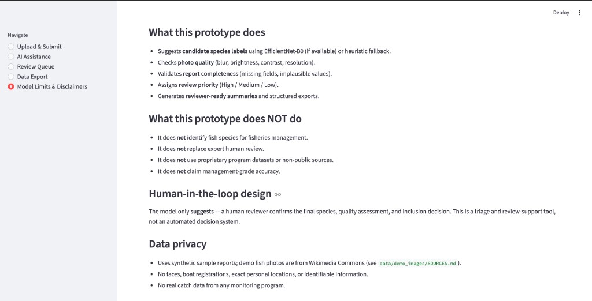

# species-report-quality-assistant-demo

[](https://github.com/ranjithguggilla/species-report-quality-assistant-demo/actions/workflows/ci.yml)


Image-assisted reporting QA — species suggestions, photo quality checks, review triage (public-data-safe).

---

## Overview

**Image-Assisted Sportfish Reporting QA Demo** (Streamlit) walks a reviewer-style workflow: upload catch metadata and a photo, run image-quality checks and candidate species suggestions, triage a review queue, and export structured artifacts—**human-in-the-loop by design**; not management-grade ID and not a substitute for expert review.

<p align="center">
  
</p>

<p align="center">
  <sub><strong>Quick tour</strong> — Upload &amp; Submit · AI Assistance · Review Queue · Data Export · Model Limits — <em>synthetic sample reports; Commons-licensed demo photos per data docs</em></sub>
</p>

<p align="center">
  <sub>Media: <code>assets/gifs/demo-overview.gif</code> · companion PNGs in <code>assets/screenshots/</code> · see <a href="assets/README.md"><code>assets/README.md</code></a> to regenerate captures</sub>
</p>

---

## Demo gallery

Static PNGs (Playwright or manual) and the overview GIF above live under **`assets/`**. Expand for full-width previews of each sidebar page.

<details>
<summary><strong>Expand: 5 UI screenshots</strong> (upload → AI assistance → queue → export → limits)</summary>

| Page | Preview |
|------|---------|
| Upload & Submit |  |
| AI Assistance |  |
| Review Queue |  |
| Data Export |  |
| Model Limits & Disclaimers |  |

</details>

---

## Data & limitations

- **Public-data-safe:** Synthetic sample reports and openly licensed demonstration photos only—see **Data privacy** below.
- **No internal HRI/CSSC data:** This repository does **not** use confidential, restricted, or internal datasets from HRI, CSSC, or partner fishery programs.
- **Prototype:** Not biological inference, stock assessment, or management-grade species identification; candidate labels require human confirmation.

---

## Purpose

This prototype is a public-data-safe demonstration of how image-assisted species suggestions and report-quality checks could support recreational fisheries reporting workflows. It uses only public or synthetic demonstration materials, does not replace expert review, and does not claim management-grade species identification. The goal is to demonstrate a human-in-the-loop workflow for cleaner, more reviewable citizen-science reports.

### Citizen-science context

Catch-reporting and citizen-science programs let anglers submit data to improve harvest and stock assessments. This prototype explores how image quality assessment and candidate species labels could speed up manual review of those submissions — without replacing the human reviewer.

## What the prototype does

- Lets a user upload a fish-report photo and enter catch metadata.
- Checks image quality (blur, brightness, contrast, resolution, fish visibility).
- Suggests candidate species labels with confidence scores.
- Compares image suggestion against user-entered species and flags mismatches.
- Validates report completeness and flags implausible values.
- Assigns review priority (High / Medium / Low).
- Generates reviewer-ready summaries.
- Exports structured CSV/JSON for downstream analysis.

## What it does NOT do

- **Does not** identify fish species for fisheries management.
- **Does not** replace expert human review.
- **Does not** use proprietary program datasets or non-public imagery.
- **Does not** claim management-grade accuracy.

## Human-in-the-loop design

The model only **suggests**:

- Possible species (candidate label)
- Confidence level
- Quality issues
- Review priority

A human reviewer confirms the final species and inclusion decision.

## Species scope

Limited to 8 Gulf-relevant species:

1. Red Snapper
2. Southern Flounder
3. Spotted Seatrout
4. Red Drum
5. Black Drum
6. King Mackerel
7. Cobia
8. Shark (broad category)

## Data privacy

The **Data & limitations** section above states the institutional scope (including no internal HRI/CSSC data). File-level notes:

- **Reports:** `data/sample_reports.csv` is synthetic only (no real angler submissions).
- **Photos:** `data/demo_images/` uses **real fish photographs** from [Wikimedia Commons](https://commons.wikimedia.org) with documented licenses — see [`data/demo_images/SOURCES.md`](data/demo_images/SOURCES.md). They are for UI demonstration only, not from any private monitoring program.
- Demo images avoid faces, boat registrations, and personal locations; do not upload identifiable private photos into a public fork without consent.

## Tech stack

- **Deep Learning:** PyTorch, torchvision, timm (EfficientNet-B0)
- **Image Processing:** OpenCV, Pillow
- **Data & UI:** Pandas, Plotly, Streamlit
- **ML Utilities:** scikit-learn (metrics, preprocessing)

## Model Architecture

### EfficientNet-B0 Species Classifier

When trained and loaded, the species suggestion module uses a fine-tuned EfficientNet-B0:

- **Base Model:** EfficientNet-B0 (ImageNet-pretrained, ~5.3M parameters)
- **Fine-tuning:** Last 2 blocks + classifier head unfrozen
- **Input Size:** 224 × 224 RGB
- **Output:** 8-class softmax (one per Gulf species)
- **Calibration:** Temperature scaling for reliable confidence estimates
- **Weights Size:** ~20MB

### Model Loading

The model weights are automatically downloaded on first run:

1. Check `~/.cache/species_qa_model/efficientnet_b0_fish.pt`
2. If missing, download from GitHub Releases
3. Verify SHA256 checksum
4. Load to GPU (if available) or CPU

If download fails or PyTorch is not installed, the system gracefully falls back to a heuristic-based stub classifier (color analysis only — not accurate for species ID).

### Fallback Stub Classifier

When the real model is unavailable:

- Uses dominant hue analysis + random noise
- Provides deterministic but inaccurate suggestions
- Displays a warning in the UI

## Project structure

```text
species-report-quality-assistant-demo/
├── app.py                        Main Streamlit application
├── src/
│   ├── image_quality.py          Photo quality scoring (OpenCV)
│   ├── species_suggest.py        Species classifier (EfficientNet-B0 or stub)
│   ├── model_loader.py           Model download and loading utilities
│   ├── calibration.py            Temperature scaling for confidence
│   ├── report_validator.py       Metadata completeness and range checks
│   ├── review_priority.py        Composite scoring and priority assignment
│   └── export_utils.py           CSV/JSON/summary generation
├── data/
│   ├── sample_reports.csv        25 synthetic report records
│   ├── species_reference.csv     Species length ranges and habitat info
│   ├── demo_images/              8 Commons-licensed species photos + SOURCES.md
│   └── training/                 Training images (gitignored); includes README.md
├── outputs/                      Generated exports and trained model checkpoints
├── scripts/
│   ├── smoke_test.py             Automated pipeline validation
│   ├── train_model.py            EfficientNet-B0 fine-tuning pipeline
│   ├── download_dataset.py       Fetch training images from iNaturalist/Commons
│   ├── capture_dashboard_media.py  Playwright PNG capture (see assets/README.md)
│   └── generate_demo_images.py   Optional solid-color placeholders (offline only)
├── assets/
│   ├── screenshots/              Dashboard PNGs (see assets/README.md)
│   ├── gifs/                     Optional short demo GIFs
│   └── README.md                 How to capture / convert media
├── .github/workflows/
│   ├── ci.yml                    Smoke tests on push/PR
│   └── release-model.yml         Model weight release automation
├── requirements.txt
├── Makefile
├── LICENSE
├── SECURITY.md
└── CONTRIBUTING.md
```

## Run locally

1. Clone and enter the project:

   ```bash
   git clone https://github.com/ranjithguggilla/species-report-quality-assistant-demo.git
   cd species-report-quality-assistant-demo
   ```

2. Install dependencies:

   ```bash
   python3 -m pip install -r requirements.txt
   ```

3. Start the app:

   ```bash
   streamlit run app.py
   ```

Or use `make`:

```bash
make setup
make run
```

## Quality checks

```bash
make smoke
```

GitHub Actions runs `scripts/smoke_test.py` on push/PR to `main`.

## Example outputs

Exports from the UI or `src/export_utils.py` are written under **`outputs/`** (created on demand):

| File | Description |
|------|-------------|
| `review_queue.csv` | Review queue as CSV |
| `review_queue.json` | Same records as JSON |
| `demo_summary.md` | Short markdown summary with priority counts |

Download buttons in the app may use the same data in memory; filenames match the helpers in `export_utils.py`.

## How this could support research workflows

- **Triage and consistency:** Surfaces photo-quality issues, metadata gaps, and species **mismatch flags** for a human reviewer— not an automated species determination for management.
- **Structured handoff:** CSV/JSON exports for methods testing and workflow demos with **synthetic** or policy-approved data only.
- **Optional ML weights:** When configured, a fine-tuned classifier provides **candidate** scores only; stub mode remains for environments without model weights.

## Scoring logic

### Image Quality Score

```
quality_score =
  0.30 * sharpness +
  0.20 * brightness +
  0.20 * contrast +
  0.20 * resolution +
  0.10 * fish_visibility
```

### Report Confidence

```
report_confidence =
  0.40 * model_confidence +
  0.30 * image_quality_score +
  0.20 * metadata_completeness +
  0.10 * consistency_score
```

### Review Priority

- **High:** report confidence < 60
- **Medium:** report confidence 60–79
- **Low:** report confidence >= 80

## Training Your Own Model

If pre-trained weights are unavailable or you want to train on custom data:

**Project root:** Run every command below from **this repository’s root folder** (the directory that contains `app.py` and `scripts/`), not from an unrelated parent folder. Example:

```bash
cd /path/to/your/clone/species-report-quality-assistant-demo
```

Install dependencies **before** training (the base `conda` Python often does not have `timm` / `torch` from this project):

```bash
pip install -r requirements.txt
# recommended: isolated env
make setup
```

Then use the venv interpreter for scripts: `.venv/bin/python scripts/train_model.py ...` or `make train-model` after `make setup`.

### 1. Download training images

```bash
python scripts/download_dataset.py --output-dir data/training --per-species 100
```

Or: `make download-data` (after `make setup`).

This fetches research-grade images from iNaturalist and Wikimedia Commons.

**Re-download after upgrades:** If an older script version downloaded the wrong taxa or hit API errors, remove `data/training/` (or per-species folders) and run the download again so each class folder matches the correct species.

### 2. Review downloaded images

**Important:** Manually review `data/training/*/` and remove:
- Mislabeled images (wrong species)
- Poor quality (blurry, bad lighting)
- Unsuitable (drawings, logos, text overlays)

### 3. Train the model

```bash
python scripts/train_model.py --data-dir data/training --epochs 50
```

Training outputs:
- `outputs/efficientnet_b0_fish.pt` — model checkpoint (~20MB)
- `outputs/model_metadata.json` — training metrics and SHA256

### 4. Deploy the model

Option A: **Local use**
```bash
cp outputs/efficientnet_b0_fish.pt ~/.cache/species_qa_model/
```

Option B: **GitHub Release** (for team sharing)
1. Create a GitHub Release (e.g., `v1.0.0-model`)
2. Upload `efficientnet_b0_fish.pt` as a release asset
3. Update `MODEL_SHA256` in `src/model_loader.py`

### Training Configuration

| Parameter | Default | Description |
|-----------|---------|-------------|
| `--epochs` | 50 | Training epochs |
| `--batch-size` | 32 | Batch size |
| `--lr` | 1e-4 | Learning rate |
| `--patience` | 5 | Early stopping patience |
| `--unfreeze-blocks` | 2 | Backbone blocks to fine-tune |

### Model Cache Location

Downloaded/trained weights are cached at:
```
~/.cache/species_qa_model/efficientnet_b0_fish.pt
```

To clear the cache and force re-download:
```python
from src.model_loader import clear_cache
clear_cache()
```

## Future improvements

- Add duplicate image detection (perceptual hashing).
- Optional EXIF hints for consistency checks (policy-reviewed; no location sharing without consent).
- Integrate Grad-CAM for model explanation overlays.
- Support batch upload of multiple reports.
- Add ONNX export for edge deployment.
